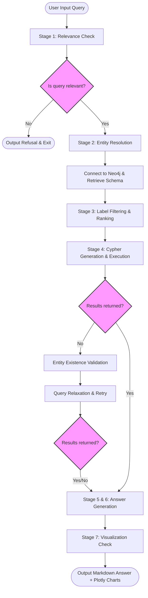

# Graph RAG System for Agrochemical & Macroeconomic Intelligence

An intelligent, multi-agent orchestrated **Graph RAG (Retrieval-Augmented Generation)** pipeline designed to translate natural-language user queries into structured database operations, query a **Neo4j** knowledge graph, synthesize analytical responses, and dynamically plot results.

This system acts as a macroeconomic analyst tool specifically configured for the supply chain, import/export trade corridors, alerts, and news related to active chemical ingredients, commodities, and commercial brands.

---

## 🚀 System Architecture & Pipeline Flow

The system runs a **7-stage pipeline** with built-in query relaxation, early refusal, validation safeguards, and fallback options:

```
       +------------------+     +------------------+     +------------------+
       |   User Query     | --> |   Azure OpenAI   | --> |      Neo4j       |
       |  (Macro/Agro)    |     |   (GPT Models)   |     |  Database (UPL)  |
       +------------------+     +------------------+     +------------------+
                                                                   |
                                                                   v
                                                         +------------------+
                                                         |  Plotly Visuals  |
                                                         |  & Markdown Resp |
                                                         +------------------+
```



For a technical deep-dive of the architectures and design specifications, consult the detailed [architecture.md](file:///Users/lavlinjaison/Desktop/python/graphrag/architecture.md) specification file.

---

## ⚙️ Core Pipeline Components & Stage Details

### Stage 1: Relevance Gate — [relevance_gate.py](file:///Users/lavlinjaison/Desktop/python/graphrag/relevance_gate.py)
* **Goal**: Light-weight LLM pre-filtering classifier that prevents running expensive downstream LLM requests or Neo4j queries if the query is unrelated to the knowledge graph.
* **Mechanism**:
  - Ingests the user query plus the immediate preceding turn query (`conversation_history[-1]`) for context (allowing context-dependent follow-up queries like *"What about France?"* or *"Are there any alerts?"* to bypass the gate).
  - Returns a JSON response containing `relevant` (boolean), `confidence` (float `0.0–1.0`), and a `reason` (string).
  - Categorizes confidence: Green ($\ge 0.8$) for highly certain, Yellow ($\ge 0.6$) for borderline/caution, and Red ($< 0.6$) for out-of-scope queries.
  - **Fail-Open Strategy**: Implements 3 attempts with exponential backoff on `RateLimitError` or `APIConnectionError`. If the service fails completely, it falls back to `relevant = True` with a `0.5` confidence score to avoid blocking the pipeline.

### Stage 2: Entity Resolution — [entity_resolver.py](file:///Users/lavlinjaison/Desktop/python/graphrag/entity_resolver.py)
* **Goal**: Normalizes and standardizes geographical names, active ingredients, and other entities mentioned in the query.
* **Mechanism**:
  - **Countries**: Resolves all country names to their ISO 3166-1 alpha-2 country codes (e.g. `"USA"`, `"United States"`, `"America"` $\rightarrow$ `"US"`).
  - **Active Ingredients**: Formats names to title-case canonical chemical naming conventions (e.g., `"glyphosate"` $\rightarrow$ `"Glyphosate"`).
  - **Strict Category Rejection**: Intentionally filters out broad generic type classifications like *"pesticides"*, *"herbicides"*, or *"agrochemicals"* to prevent filtering relationships on empty or invalid entity strings.
  - **Historical Turn Resolution**: Refers to conversation history contexts to map references like *"that country"* or *"this ingredient"* back to their resolved values.

### Stage 3: Label Filtering & Schema Pruning — [label_filter.py](file:///Users/lavlinjaison/Desktop/python/graphrag/label_filter.py)
* **Goal**: Identifies which Neo4j node labels are required to solve the query, pruning irrelevant schema paths to decrease LLM prompt token sizes in Stage 4.
* **Mechanism**:
  - Filters all database labels down to a ranked list of relevant labels.
  - **Anchor Rule**: Guarantees that `ACTIVE_INGREDIENT` is always included for queries regarding trade, import/export, pricing, or supply chains.
  - **Alert Rule**: Guarantees `ALERT` is always paired with `COMMODITY` when alerts, warnings, severity levels, or risk alerts are mentioned.
  - Uses connection schema structure mappings and node property catalogs to resolve ambiguous query requests.

### Stage 4: Cypher Generation & Relaxation — [cypher_gen.py](file:///Users/lavlinjaison/Desktop/python/graphrag/cypher_gen.py)
* **Goal**: Selects the planning strategy, generates a read-only Cypher query, and executes it.
* **Planning Strategies**:
  1. `SINGLE`: A standard traversal query for simple lookups.
  2. `MULTI`: Decomposes complex queries with independent joins (e.g., aggregate statistics AND listing individual rows) into up to 3 sub-queries.
  3. `EXPLORE`: For broad open-ended prompts (e.g., *"tell me about Glyphosate"*), it plans 3–5 distinct analytical queries (trade corridors, brands, alerts, news, commodity links) to build a comprehensive summary.
* **Core Enforcements**:
  - **3-Hop Trade Corridor Integrity**: Prevents single-hop matches. Expands imports/exports into: `(origin:COUNTRY)-[e:EXPORTS]->(ai:ACTIVE_INGREDIENT)-[t:TO]->(dest:COUNTRY)` and enforces `e.id = t.id` constraint validation to ensure correct origin-destination identity mappings.
  - **Safety Guard**: Evaluates the generated Cypher with a regex filter blocking write keywords: `CREATE`, `MERGE`, `SET`, `DELETE`, `DETACH`, `REMOVE`, `DROP`, `CALL apoc.*write`.
  - **Lucene Fuzzy Commodity Resolver**: Queries full-text search indexes using fuzzy triggers (`term~`) to catch spelling errors or partial mentions.
  - **Self-Healing Query Relaxation**: If a single query returns 0 rows, the system checks if the entity exists at all. If it does, Azure OpenAI is invoked to automatically relax filters (e.g. converting `=` to `CONTAINS`, dropping relationship property filters, or reducing JOIN depth) and retries.

### Stages 5 & 6: Data Serialization & Response Synthesis — [answer_gen.py](file:///Users/lavlinjaison/Desktop/python/graphrag/answer_gen.py)
* **Goal**: Transforms database rows into readable tables and generates a natural-language analysis.
* **Mechanism**:
  - **Stage 5**: Programmatically serializes Neo4j dictionaries into Markdown tables. For multi-query modes, tables are grouped by sub-query.
  - **Stage 6**: Invokes Azure OpenAI to summarize key findings, perform math calculations/sums, and detail alert statuses. Ingests a sliding window of the last 3 conversation history turns.
  - **Graceful Fail-Soft**: If the synthesis fails due to rate limits or API timeouts, it bypasses the LLM and outputs the raw Markdown tables directly.

### Stage 7: Semantic Visualization — [visualizer.py](file:///Users/lavlinjaison/Desktop/python/graphrag/visualizer.py)
* **Goal**: Checks if the query context is suitable for charting and plans/renders Plotly graphs.
* **Mechanism**:
  - **Intent Classification**: Evaluates if the query is analytical (rankings, trends, comparisons, growth counts) or a lookup (e.g., *"describe Glyphosate"*). Bypasses visualization for lookups to prevent chart clutter.
  - **LLM Chart Planner**: Decides optimal plot type (`line`, `bar`, `pie`, `count_bar`, `scatter`), axis properties, coloring groups, and business titles.
  - **Heuristic Fallback**: Falls back to column data type evaluation (e.g., time + numeric values $\rightarrow$ line chart; categorical + numeric values $\rightarrow$ bar chart) if the LLM planner is disabled.
  - **ISO Code Expansion**: Programmatically checks columns for ISO country codes (`"US"`, `"IN"`, `"CN"`) and maps them to human-readable names (`"United States"`, `"India"`, `"China"`) on chart axes.
  - Generates responsive HTML structures, stores them in `charts/`, and triggers `webbrowser.open` to launch them.

---

## 📈 Neo4j Knowledge Graph Schema

The Neo4j database uses a 3-hop corridor pattern to model import/exports of active ingredients between countries. Here is the visual structural overview of the graph:

```mermaid
erDiagram
    ACTIVE_INGREDIENT {
        string name
        string type
        string formula
    }
    BRAND {
        string name
        string category
    }
    COMMODITY {
        string name
        string symbol
        string aliases
    }
    COUNTRY {
        string name
        string iso_code
    }
    CURRENCY {
        string name
        string code
    }
    NEWS {
        string title
        string date
        string source
    }
    ALERT {
        string id
        string title
        string severity
        string status
        string alert_type
        string created_at
    }

    BRAND }|--|| ACTIVE_INGREDIENT : CONTAINS
    ACTIVE_INGREDIENT }|--|| COMMODITY : USED_IN
    ALERT }|--|| COMMODITY : AFFECTS_COMMODITY
    
    COUNTRY ||--o{ EXPORTS : EXPORTS
    EXPORTS }|--|| ACTIVE_INGREDIENT : EXPORTS
    EXPORTS }|--|| COUNTRY : TO
    
    COUNTRY ||--o{ IMPORTS : IMPORTS
    IMPORTS }|--|| ACTIVE_INGREDIENT : IMPORTS
    IMPORTS }|--|| COUNTRY : TO

    NEWS }|--|| ACTIVE_INGREDIENT : MENTIONS_ACTIVE_INGREDIENT
    NEWS }|--|| COUNTRY : MENTIONS_COUNTRY
    NEWS }|--|| COMMODITY : MENTIONS_COMMODITY
    NEWS }|--|| CURRENCY : MENTIONS_CURRENCY
```

---

## 🛠️ Configuration Options ([config.py](file:///Users/lavlinjaison/Desktop/python/graphrag/config.py))

You can tune system parameters directly in the configuration catalog:

```python
# Neo4j Configurations
NEO4J_URI      = "neo4j://localhost:7687"
NEO4J_USER     = "neo4j"
NEO4J_PASSWORD = "<your_password>"
NEO4J_DATABASE = "learning"
MAX_NODES      = 20          # Max nodes returned per label in search fallbacks

# Azure OpenAI Credentials & Models
AZURE_KEY      = "<your_api_key>"
AZURE_VERSION  = "2024-12-01-preview"
AZURE_ENDPOINT = "https://dna-openai-swc-cp-dev.openai.azure.com/"
AZURE_MODEL    = "gpt-41-mini-def-glb-std-dev"

# Stage 1 Relevance Bounds
CONFIDENCE_HIGH   = 0.8     # Minimum score for high-confidence decisions
CONFIDENCE_MEDIUM = 0.6     # Borderline threshold score (shows console warning)

# Stage 4 Cypher Settings
CYPHER_DEFAULT_LIMIT = 25   # Default limit applied to queries
CYPHER_MAX_RETRIES   = 3    # Retry attempts on OpenAI rate limits

# Dialogue Memory
MAX_HISTORY = 5              # Max conversation turns to keep in context window

# Stage 7 Visualization Control
VIZ_ENABLED         = True  # Toggle visualization entirely
VIZ_LLM_ENABLED     = True  # True: Use LLM planner, False: Heuristics only
VIZ_MIN_ROWS        = 3     # Min data rows needed to justify a chart
VIZ_MAX_PIE_CATS    = 10    # Max categories for pie charts (falls back to bar)
VIZ_OUTPUT_DIR      = "charts"  # Target output directory
VIZ_OPEN_BROWSER    = True  # Auto-open chart HTML files in web browsers
```

---

## 🌎 Setup & Offline Data Enrichment

### 1. Requirements & Dependencies
Install dependencies declared in the [requirements.txt](file:///Users/lavlinjaison/Desktop/python/graphrag/requirements.txt) file:
```bash
pip install -r requirements.txt
```

### 2. ISO Code Pre-population Script ([add_iso_codes.py](file:///Users/lavlinjaison/Desktop/python/graphrag/add_iso_codes.py))
Entity mapping in Stage 2 maps user country queries directly to 2-letter ISO codes. To populate this mapping:
1. Ensure your Neo4j instance contains your target data.
2. Edit [config.py](file:///Users/lavlinjaison/Desktop/python/graphrag/config.py) with valid database connection details.
3. Run the enrichment script to automatically fetch all country nodes, query Azure OpenAI to resolve their ISO codes, and save them to the `iso_code` property:
```bash
python add_iso_codes.py
```

### 3. Lucene Indexing for Fuzzy Matching
The system uses a full-text search index (`commodity_search`) on `COMMODITY` nodes. The indexing is handled idempotently in [neo4j_helpers.py](file:///Users/lavlinjaison/Desktop/python/graphrag/neo4j_helpers.py) under [ensure_commodity_fulltext_index](file:///Users/lavlinjaison/Desktop/python/graphrag/neo4j_helpers.py#L186-L197). This index is automatically checked when searching for commodities.

---

## 🏃 Execution Modes ([main.py](file:///Users/lavlinjaison/Desktop/python/graphrag/main.py))

You can run the main orchestrator in two operational modes:

### Mode A: Single-Shot Command Line Query
Pass a search query string directly as a command-line argument:
```bash
python main.py "which countries export Glyphosate to Brazil?"
```

### Mode B: Context-Aware Interactive Shell
Run the script without any trailing arguments. This starts an interactive shell that holds memory of up to `MAX_HISTORY` turns:
```bash
python main.py
```
```text
Graph RAG Agent -- UPL Knowledge Graph
Type 'exit' or 'quit' to end the session.

Enter your query: which countries export Glyphosate?
...
Stage 1 -- Relevance Check
Relevant (confidence 100%) -- Directly asks about country-level export relationships for Glyphosate.

Stage 2 -- Entity Resolution
Resolved active ingredients:
  Glyphosate -> Glyphosate

Stage 3 -- Label Filtering
Relevant labels (ranked):
  1. ACTIVE_INGREDIENT           -- Glyphosate is an active ingredient
  2. COUNTRY                     -- Exporters and destination countries
  3. BRAND                       -- Associated trade brands

Stage 4 -- Cypher Generation
Generated Cypher:
  MATCH (origin:COUNTRY)-[e:EXPORTS]->(ai:ACTIVE_INGREDIENT)-[t:TO]->(dest:COUNTRY)
  WHERE e.id = t.id AND toLower(ai.name) = 'glyphosate'
  RETURN origin.name AS exporting_country, dest.name AS importing_country, ai.name AS ingredient
  LIMIT 25

Stage 5+6 -- Answer Generation
(Presents Markdown explanation and summary charts)
...

Enter your query: what about those exporting to Brazil?
(Stage 2 automatically resolves "those" to Glyphosate and "Brazil" to BR based on turn history)
```

Interactive Plotly HTML visualization assets are automatically stored under `/charts` and opened in the default browser.
