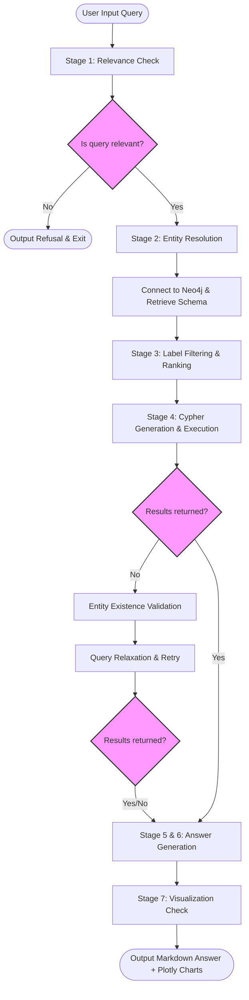
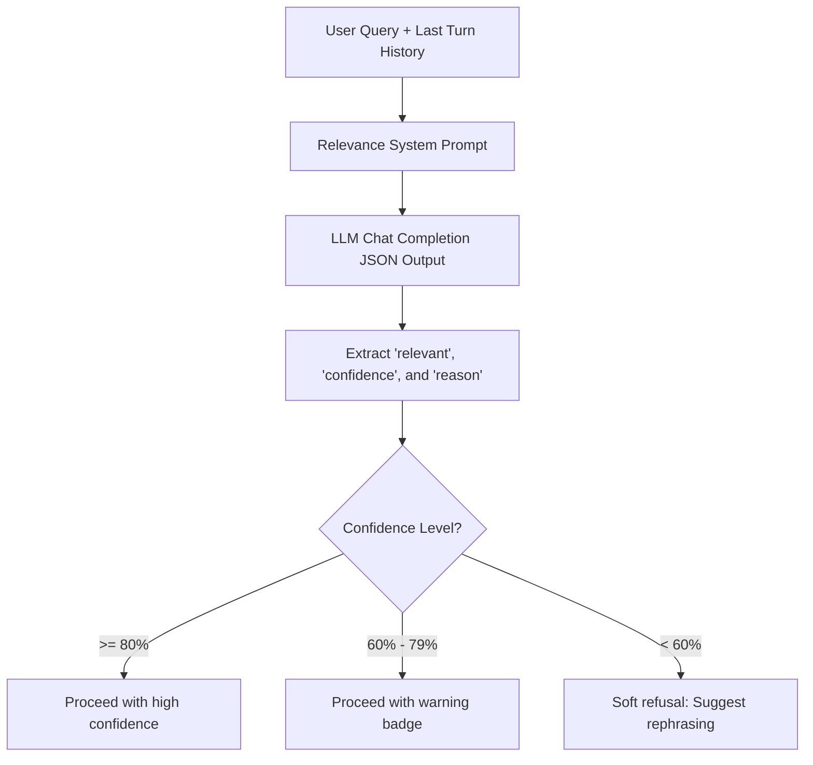
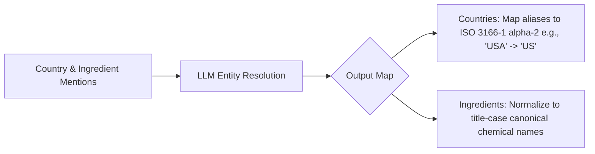
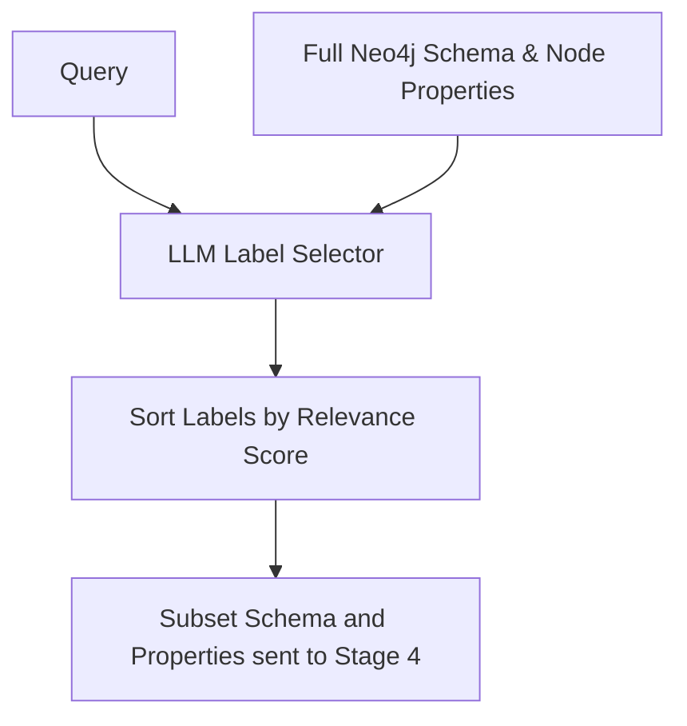
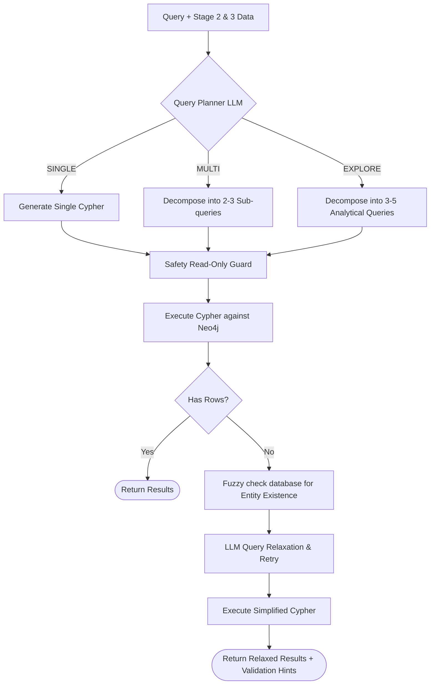
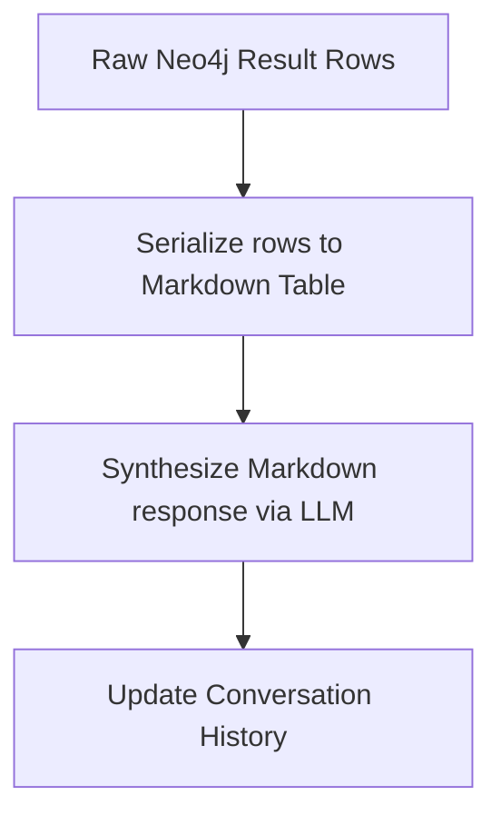
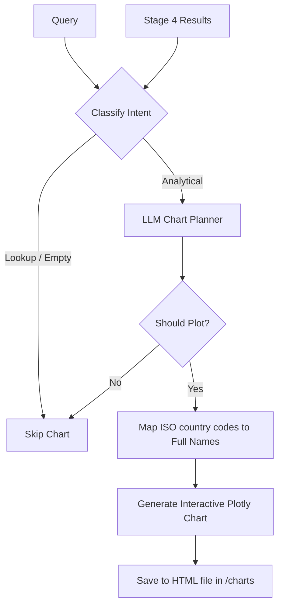

# Graph RAG System: Architecture & Technical Design Specification

This document details the architecture, data flow, features, and mini-architectures of the UPL Macroeconomic and Agrochemical Graph RAG (Retrieval-Augmented Generation) system.

---

## 1. System Overview & Technology Stack

The Graph RAG system is a multi-agent orchestrated pipeline designed to translate natural-language user queries into structured database operations, query a **Neo4j** knowledge graph, synthesize analytical responses, and dynamically plot results.

```
       +------------------+     +------------------+     +------------------+
       |   User Query     | --> |   Azure OpenAI   | --> |      Neo4j       |
       |  (Macro/Agro)    |     |   (GPT Models)   |     |  Database (UPL)  |
       +------------------+     +------------------+     +------------------+
                                                                   |
                                                                   v
                                                         +------------------+
                                                         |  Plotly Visuals  |
                                                         |  & Markdown Resp |
                                                         +------------------+
```

### Core Technologies
- **Orchestrator**: Python ([main.py](file:///Users/lavlinjaison/Desktop/python/graphrag/main.py))
- **Graph Database**: Neo4j (via `neo4j-python-driver`)
- **Large Language Model**: Azure OpenAI (GPT-4o Mini)
- **Data Manipulation**: Pandas
- **Visualization**: Plotly Express & Plotly Graph Objects
- **Terminal UI**: Rich

---

## 2. Global Pipeline Architecture

The overall orchestrator controls a sequential **7-stage pipeline** with short-circuit and recovery strategies:



---

### 3. Mini-Architectures by Layer

### Stage 1: Relevance Gate ([relevance_gate.py](file:///Users/lavlinjaison/Desktop/python/graphrag/relevance_gate.py))
Determines whether a query is answerable using UPL's knowledge graph schema (Active Ingredients, Brands, Countries, Commodities, Alerts, News, and Currencies) before executing expensive database or downstream LLM operations.



- **In-Depth Layer Features**:
  - **Context-Aware Sliding Window**: Ingests the immediate preceding turn query (`conversation_history[-1]`) so that follow-up context-dependent queries (e.g., *"What about France?"* or *"Are there any alerts?"*) are not rejected by the relevance check.
  - **Dynamic Confidence Boundaries**: Returns a confidence score from `0.0` to `1.0`. The main orchestrator maps this score to Rich console color coding (Green for high $\ge 0.8$, Yellow for borderline $\ge 0.6$, Red for uncertain $< 0.6$) and formats user warnings appropriately.
  - **Fail-Open Strategy**: Uses try-catch blocks wrapping the Azure OpenAI API. If API rate limits (`RateLimitError`) or connection errors (`APIConnectionError`) occur, it retries with exponential backoff (2 * attempt). If retries exhaust or any other APIError occurs, it falls back to `relevant=True` to avoid blocking the pipeline due to an external service outage.

---

### Stage 2: Entity Resolution ([entity_resolver.py](file:///Users/lavlinjaison/Desktop/python/graphrag/entity_resolver.py))
Normalizes user mentions of entities to match database schema conventions.



- **In-Depth Layer Features**:
  - **Synonym & Alias Mapping**: Standardizes complex synonyms, abbreviations, and informal names to exact codes (e.g., `"Emirates"`, `"UAE"`, `"Dubai"` $\rightarrow$ `"AE"`; `"Britain"`, `"UK"`, `"England"` $\rightarrow$ `"GB"`).
  - **Historical Turn Resolution**: Ingests conversation history context, enabling references like *"that country"* or *"this ingredient"* to be mapped back to their canonical forms based on prior conversation turns.
  - **Strict Category Rejection**: Prevents extraction of broad category words like *"pesticides"*, *"herbicides"*, or *"agrochemicals"* under ingredient lists, ensuring subsequent steps perform category filters rather than database string matches for nonexistent chemical names.
  - **Ambiguity Resolver**: Selects the most likely variant in case of ambiguous geographical names (e.g. North/South Korea $\rightarrow$ KP/KR) and drops unresolvable entities by checking for `"XX"` fallbacks to keep the database inputs clean.

---

### Stage 3: Label Filtering & Ranking ([label_filter.py](file:///Users/lavlinjaison/Desktop/python/graphrag/label_filter.py))
Prunes the Neo4j schema, contextually filtering out unrelated database components to fit inside the LLM context window.



- **In-Depth Layer Features**:
  - **Constraint Enforcers (Anchor Rules)**: Applies structural heuristics, guaranteeing that critical base entities (like `ACTIVE_INGREDIENT` for trade flows or crop protection queries) and paired entities (like `ALERT` and `COMMODITY` for risk signals) are always pulled together.
  - **Property/Schema Pruning**: Slices the overall visual graph schema (`filter_schema`) and node properties catalog (`filter_node_properties`) to match only the relevant ranked labels, dramatically reducing LLM token consumption in subsequent query-generation steps.
  - **Fuzzy Target Identification**: Uses property descriptions to resolve label names whose direct terminology is ambiguous.

---

### Stage 4: Query Strategy, Generation & Relaxation ([cypher_gen.py](file:///Users/lavlinjaison/Desktop/python/graphrag/cypher_gen.py))
Handles strategic query execution, translating questions into one or more Cypher statements.



- **In-Depth Layer Features**:
  - **Dynamic Query Strategy Planner**: Evaluates queries to choose between a `SINGLE` lookup query, a `MULTI` query approach (joining independent metrics without cartesian product bottlenecks), or an `EXPLORE` overview plan (generating 3-5 distinct analytical questions, such as active ingredients, trade corridors, brands, and news).
  - **Corridor Integrity Enforcer**: Automatically expands 2-node relationships to 3-hop trade corridor structures `(origin:COUNTRY)-[EXPORTS/IMPORTS]->(ai:ACTIVE_INGREDIENT)-[TO]->(dest:COUNTRY)` enforcing corridor identity matching (`e.id = t.id`), ensuring both source and destination elements are fully tracked.
  - **Safety Read-Only Guard**: Explicit regex parser validates generated query text to reject database mutations (`CREATE`, `MERGE`, `DELETE`, `SET`, `DROP`, `CALL apoc.write...`).
  - **Lucene Fuzzy Commodity Resolver**: Integrates a Neo4j full-text search index (`db.index.fulltext.queryNodes`) on `COMMODITY` name and alias properties to locate matches under user-typo conditions.
  - **Self-Healing Query Relaxation**: If the generated Cypher returns 0 rows, the system programmatically resolves whether the entities exist at all. If entities are present, it uses Azure OpenAI to automatically relax filters (e.g., dropping relationship properties, converting exact matches to `CONTAINS`) and re-executes the simplified query.

---

### Stages 5 & 6: Data Serialization & Response Synthesis ([answer_gen.py](file:///Users/lavlinjaison/Desktop/python/graphrag/answer_gen.py))
Formats retrieved data and synthesizes user-friendly answers.



- **In-Depth Layer Features**:
  - **Sub-Query Tabular Serialization**: Formats query results into clean Markdown tables, grouped contextually by sub-query for multi-query execution.
  - **Conversational Context Synthesis**: Prompts the analyst agent with conversation history turns (using a sliding window of the last 3 turns) to synthesize an explanation that answers follow-up questions coherently.
  - **Graceful Failure Degradation**: Includes exception safeguards. If the conversational summary synthesis fails, it bypasses the LLM and outputs the raw Markdown tables directly so the user still receives the correct data.

---

### Stage 7: Semantic Visualization ([visualizer.py](file:///Users/lavlinjaison/Desktop/python/graphrag/visualizer.py))
Determines whether a graphical visualization is appropriate and builds responsive Plotly graphs.



- **In-Depth Layer Features**:
  - **Intent Classification**: Classifies query intent based on linguistic patterns (e.g. *"how many"*, *"compare"*, *"growth"*) and returned column metadata. Ensures simple lookups (e.g. *"describe Glyphosate"*) do not generate chart clutter.
  - **LLM Chart Planner**: Uses Azure OpenAI as a visualization planner to determine optimal chart types (line, bar, pie, count-bar, scatter), identifying the best axes, titles, and legends.
  - **ISO Code Expansion**: Programmatically checks columns for two-letter country codes (`"US"`, `"IN"`, `"CN"`) and maps them to full display labels (e.g. `"United States"`, `"India"`, `"China"`) on chart axes to make them presentation-ready.
  - **Standalone Chart Serialization**: Exports charts as interactive standalone Plotly HTML structures saved in `charts/` and auto-opens them in the user's default web browser.

---

## 4. Neo4j Knowledge Graph Schema

Below is the graph schema structure utilized by this RAG system:

```mermaid
erDiagram
    ACTIVE_INGREDIENT {
        string name
        string type
        string formula
    }
    BRAND {
        string name
        string category
    }
    COMMODITY {
        string name
        string symbol
        string aliases
    }
    COUNTRY {
        string name
        string iso_code
    }
    CURRENCY {
        string name
        string code
    }
    NEWS {
        string title
        string date
        string source
    }
    ALERT {
        string id
        string title
        string severity
        string status
        string alert_type
        string created_at
    }

    BRAND }|--|| ACTIVE_INGREDIENT : CONTAINS
    ACTIVE_INGREDIENT }|--|| COMMODITY : USED_IN
    ALERT }|--|| COMMODITY : AFFECTS_COMMODITY
    
    COUNTRY ||--o{ EXPORTS : EXPORTS
    EXPORTS }|--|| ACTIVE_INGREDIENT : EXPORTS
    EXPORTS }|--|| COUNTRY : TO
    
    COUNTRY ||--o{ IMPORTS : IMPORTS
    IMPORTS }|--|| ACTIVE_INGREDIENT : IMPORTS
    IMPORTS }|--|| COUNTRY : TO

    NEWS }|--|| ACTIVE_INGREDIENT : MENTIONS_ACTIVE_INGREDIENT
    NEWS }|--|| COUNTRY : MENTIONS_COUNTRY
    NEWS }|--|| COMMODITY : MENTIONS_COMMODITY
    NEWS }|--|| CURRENCY : MENTIONS_CURRENCY
```

---

## 5. Architectural Resiliency Patterns

| Feature | Scenario | Mitigation Strategy | File |
| :--- | :--- | :--- | :--- |
| **Early Refusal** | Irrelevant or out-of-scope query | The relevance gate prevents unnecessary database connections and expensive LLM calls. | [relevance_gate.py](file:///Users/lavlinjaison/Desktop/python/graphrag/relevance_gate.py) |
| **Schema Pruning** | Schema size exceeds LLM context limit | Selects and sends only the labels and properties relevant to the user query to the LLM. | [label_filter.py](file:///Users/lavlinjaison/Desktop/python/graphrag/label_filter.py) |
| **Write Protections** | LLM generates destructive Cypher | A regex parser validates the query. Operations containing `DELETE`, `MERGE`, `SET`, or `CREATE` are blocked. | [cypher_gen.py](file:///Users/lavlinjaison/Desktop/python/graphrag/cypher_gen.py) |
| **Fuzzy Search Fallback** | Minor typos in commodity names | Resolves mentions using full-text search index matching with Lucene query rules (`term~`). | [neo4j_helpers.py](file:///Users/lavlinjaison/Desktop/python/graphrag/neo4j_helpers.py) |
| **Query Relaxation** | Cypher query matches 0 rows | Simplifies queries by dropping restrictive clauses and filters, running a retried search. | [cypher_gen.py](file:///Users/lavlinjaison/Desktop/python/graphrag/cypher_gen.py) |
| **Graceful Degradation** | LLM response generation timeout | Falls back to printing raw database tables in Markdown when conversational synthesis fails. | [answer_gen.py](file:///Users/lavlinjaison/Desktop/python/graphrag/answer_gen.py) |
